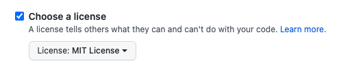

# Why open-source matters?

- We use it every day
- We can learn from it by
  - reading others code
  - receiving feedback on PRs
- Learn automation
- We can get job opportunities

# `package.json`

- [`package.json`](../package.json)
- [NPM](https://www.npmjs.com/package/@ikim23/add-one)

```
{
  "name": "@ikim23/add-one",
  "version": "1.0.0",
  "description": "Increment number",
  "keywords: ["increment"],
  "homepage": "https://github.com/ikim23/add-one#readme",
  "repository": {
    "type": "git",
    "url": "git+https://github.com/ikim23/add-one.git"
  },
  "bugs": {
    "url": "https://github.com/ikim23/add-one/issues"
  },
  "publishConfig": {
    "access": "public"
  },
  "license": "MIT",
  "author": "ikim23",
  "main": "dist/index.js",
  "module": "dist/add-one.esm.js",
  "typings": "dist/index.d.ts",
  "files": ["dist", "src"],
  ...
}

```

# Semantic Versioning

[semver.org](https://semver.org/)


# Licensing

[choosealicense.com](https://choosealicense.com/)
[Which open-source license is appropriate for my project?](https://opensource.guide/legal/#which-open-source-license-is-appropriate-for-my-project)
[LICENSE file](https://github.com/ikim23/add-one/blob/master/LICENSE)

Available options on Github:

- Apache License 2.0
- GNU General Public License v3.0
- MIT License
- BSD 2-Clause "Simplified" License
- BSD 3-Clause "New" or "Revised" License
- Boost Software License 1.0
- Creative Commons Zero v1.0 Universal
- Eclipse Public License 2.0
- GNU Affero General Public License v3.0
- GNU General Public License v2.0
- GNU Lesser General Public License v2.1
- Mozilla Public License 2.0
- The Unlicense



# Releasing the module (manual)

- `git tag v1.0.1`
- tags on Github

```
npm login
npm version [patch|minor|major]
git push --follow-tags
npm publish
```

How about:

- Write CHANGELOG?
- Create Github Release

# Releasing the module (automated)

## [Semantic-Release](https://semantic-release.gitbook.io/semantic-release/)

> **semantic-release** automates the whole package release workflow including: determining the next version number, generating the release notes, and publishing the package.

### Angular commit messages

https://github.com/conventional-changelog/conventional-changelog/tree/master/packages/conventional-changelog-angular

```
<type>(<scope>): <subject>

<message body>

<message footer>
```

Each commit message consists of:

- header
  - type
    - will appear in CHANGELOG: `feat`, `fix`, `perf`, `BREAKING CHANGE`
    - non-CHANGELOG related tasks: `build`, `ci`, `docs`, `style`, `refactor`, `test`
  - scope
  - subject
- body
- footer

[Commitizen](https://github.com/commitizen/cz-cli)
[Commitlint](https://github.com/conventional-changelog/commitlint)

# Github Automation

- Code of conduct
  - [React's Code of Conduct](https://github.com/facebook/react/blob/main/CODE_OF_CONDUCT.md)
- Contributing guide
- [React's Contributing guide](https://reactjs.org/docs/how-to-contribute.html)
- Templates:
  - Issues
    - [Create issue](https://github.com/facebook/react/issues)
  - Pull Requests
    - [React Pull Request Template](https://github.com/facebook/react/blob/main/.github/PULL_REQUEST_TEMPLATE.md)
- [Code owners](https://github.com/ikim23/add-one/blob/master/.github/CODEOWNERS)
  - [Docs](https://docs.github.com/en/repositories/managing-your-repositorys-settings-and-features/customizing-your-repository/about-code-owners)
- Github Actions
- [Dependabot](../.github/dependabot.yml)
- [Probot: Stale](../.github/stale.yml)
  - [example](https://github.com/facebook/react/issues/15556#issuecomment-572935885)
- Funding
  - [Docs](https://docs.github.com/en/repositories/managing-your-repositorys-settings-and-features/customizing-your-repository/displaying-a-sponsor-button-in-your-repository)
  - [Example Babel](https://github.com/babel/babel)

# Contribute

[Good first issue](https://github.com/facebook/react/labels/good%20first%20issue)
